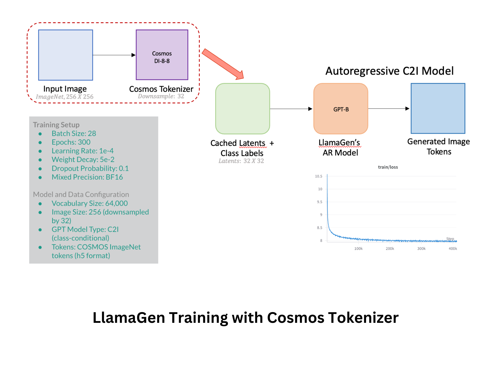

# LlamaGen Training with Cosmos Tokenizer
<p align="center">

<p>


> This is a modified training implementation of [LlamaGen](https://github.com/FoundationVision/LlamaGen) that uses Cosmos DI8-8 tokenizer with cached latents.

## 🌿 Introduction
This repository provides a multi-node distributed training setup for LlamaGen class-conditional image generation using cached latents from the Cosmos tokenizer. The key modifications from the original LlamaGen implementation include:

* Replaced original tokenizer with Cosmos DI8-8 tokenizer
* Uses pre-cached latents from ImageNet dataset
* Focused on class-conditional image generation training
* Multi-node distributed training support

## 🔧 Training Setup

### Hardware Requirements
* NVIDIA RTX A6000 GPUs (48GB memory)
* Multi-node compute environment with SLURM
* Achieved throughput: 26 images/sec per GPU

### Prerequisites
* Pre-cached Cosmos DI8-8 latents for ImageNet dataset (h5 format)
* Multi-node compute environment with SLURM
* Create `./pretrained_models` directory for checkpoints

### Environment Requirements
* Python 3.11.5
* CUDA 12.1
* PyTorch 2.3.1
* torchvision 0.18.1

For complete environment setup, use the provided `environment.yml`:
```bash
conda env create -f environment.yml
conda activate llamagen-cosmos
```

### Training Configuration
We train LlamaGen's AR model LlamaGen-B (184,026,624 parameters) with the following settings:

Model Configuration:
* GPT Model: LlamaGen-B (specified via --gpt-model GPT-B)
* Vocabulary Size: 64,000
* Image Size: 256 (downsampled by 32)
* Model Type: C2I (class-conditional)
* Token Format: COSMOS ImageNet tokens (h5 format)


## 🚀 Training Launch & Main Training Components
* Training script: `/autoregressive/train/train_c2i.py`
* Launch script: `/scripts/autoregressive/train_c2i_launch.sh`
The launch script provides SLURM configuration for distributed training across multiple nodes.

The main training can be launched using:
```bash
sbatch scripts/autoregressive/train_c2i_launch.sh
```
### Key Features
* Multi-node distributed training using SLURM
* Cached latents for efficient training
* Class-conditional image generation
* Built on LlamaGen's autoregressive architecture


## 📝 References
This work was implemented as part of [Prof. Tom Goldstein's Lab](https://www.cs.umd.edu/~tomg/) at the University of Maryland.

This work builds upon:
> [**Autoregressive Model Beats Diffusion: Llama for Scalable Image Generation**](https://arxiv.org/abs/2406.06525)<br>
> Peize Sun, Yi Jiang, Shoufa Chen, Shilong Zhang, Bingyue Peng, Ping Luo, Zehuan Yuan<br>
> HKU, ByteDance

For the original implementation, visit [LlamaGen GitHub Repository](https://github.com/FoundationVision/LlamaGen/tree/main?tab=readme-ov-file).

This implementation uses [NVIDIA Cosmos Tokenizer](https://github.com/NVIDIA/Cosmos-Tokenizer) for image tokenization:
> **NVIDIA Cosmos Tokenizer**: A suite of image and video neural tokenizers that advances the state-of-the-art in visual tokenization. We specifically use their DI8-8 tokenizer for efficient image encoding.


## License
This project follows the same MIT License as the original LlamaGen repository.

